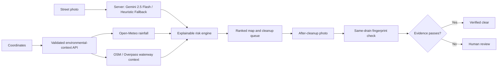

# Varun AI - Intelligent Drainage Management System

> Stop street waste before the next storm moves it downstream.

**Varun AI** is a smart, AI-assisted environmental monitoring system built to prioritize and verify storm-drain and waterway cleanups. A field worker uploads a street photo, and the app uses advanced artificial intelligence (Google Gemini 2.5 Flash + robust visual heuristics) to analyze visual evidence. It combines blockage and litter signals with location-specific rainfall and mapped waterway context, ranking the report for immediate action. 

---

## 🚀 How to Run Varun AI Locally (Easy Setup)

Setting up Varun AI is incredibly easy! You can run this project on a Windows, Mac, or Linux computer by following these simple steps.

### Prerequisites
- **Node.js** (Version 22.13 or newer). Download it for free from [nodejs.org](https://nodejs.org/).
- **Git** (Optional, for downloading the code).

### Step 1: Get the Code
Download this repository to your computer. Open your terminal or command prompt and run:
```bash
git clone https://github.com/niteshislol/VarunAI.git
cd VarunAI/VarunAI-DrainageSystem
```

### Step 2: Install Dependencies
Make sure you are inside the `VarunAI-DrainageSystem` folder, and run:
```bash
npm install
```

### Step 3: Add Your Gemini API Key
Varun AI uses Google's powerful Gemini 2.5 Flash model to analyze images. 
1. Create a new file in the root folder of the project (`VarunAI-DrainageSystem`) and name it exactly: `.env`
2. Open the `.env` file in any text editor and add this single line:
   ```text
   GEMINI_API_KEY=your_actual_api_key_here
   ```
   *(Replace `your_actual_api_key_here` with your real Gemini API key from Google AI Studio).*

### Step 4: Start the App
Start the local development server by running:
```bash
npm run dev
```

### Step 5: Open in Your Browser
Open your favorite web browser and go to: 👉 **[http://localhost:3000](http://localhost:3000)**

---

## 🌊 The Problem

Municipal crews cannot inspect every drain before heavy rainfall. Cleanup is often reactive and driven by complaints rather than consistent evidence. Visible litter, organic debris, and rainfall together can make a blocked inlet more urgent, yet teams rarely have one ranked, explainable queue.

Varun AI answers a practical question:
> Which reported drain should a cleanup team inspect first?

It is a prioritization aid, not a flood predictor or replacement for engineering assessment.

## ✨ What it does

- **Instant AI Analysis**: Uses **Gemini 2.5 Flash** server-side for robust image interpretation, falling back to an engineered heuristic visual scorer if the API is unavailable.
- **Interactive Dashboard**: A comprehensive executive UI including a Budget Allocator, Asset Diagnostics, Simulator, and AI Scanner.
- **Environmental Context**: Fetches rainfall for each report's latitude and longitude through a validated server endpoint backed by Open-Meteo.
- **Waterway Mapping**: Looks up nearby rivers, streams, canals, and water bodies through OpenStreetMap / Overpass.
- **Explainable priority score**: Explains every factor and contribution behind the result (Blockage, Litter, Rain).

## 📊 Complete product workflow

| Stage | What the user does | What Varun AI returns |
| --- | --- | --- |
| **Inspect** | Upload a drain photo or reset the controlled sample | Blockage, drain-presence, litter, confidence, rainfall, waterway context, and explainable priority |
| **Prioritize** | Search a location, review the map, and inspect the ranked queue | Location-aware reports, environmental concern, reason for ranking, persistence state, and human-review actions |
| **Verify** | Upload an after-cleanup photo and compare it | Same-drain match, before/after deltas, pass/fail checks, verified-clear status or human review |

## 🧠 AI and computer vision

Varun AI uses a layered evidence pipeline:
1. **Gemini 2.5 Flash Vision Engine** — Processes the image securely on the server to extract blockage severity, litter density, obstruction types, and recommended interventions.
2. **Robust Heuristic Fallback** — If Gemini is offline, the system falls back to a deterministic, offline visual scorer that analyzes image structure, edge geometry, natural-scene color, and debris-tone signals.
3. **Same-drain verification** — Normalized low-resolution scene fingerprints compare before/after composition to ensure a 68% scene match.

## 🏗️ Architecture



## 🛠️ Technology

- Next.js 16 and React 19
- **Google Generative AI (Gemini 2.5 Flash)**
- TypeScript & Tailwind CSS
- Server-side image processing (`sharp`)
- Leaflet and OpenStreetMap
- Open-Meteo weather and geocoding APIs
- OpenStreetMap Overpass environmental-context lookup
- Vercel deployment

## 🔐 Privacy and persistence

Photo analysis runs efficiently on the server (Gemini/Node.js). Reports and compressed evidence currently persist in browser storage on the inspection device. A shared authenticated municipal backend is planned for multi-user deployments.

## 📜 Data and service attribution

- Weather: [Open-Meteo](https://open-meteo.com/)
- Maps: [OpenStreetMap](https://www.openstreetmap.org/) and [Leaflet](https://leafletjs.com/)
- AI Models: [Google Gemini](https://deepmind.google/technologies/gemini/)

## 📝 License

Varun AI application code is released under the MIT License.
